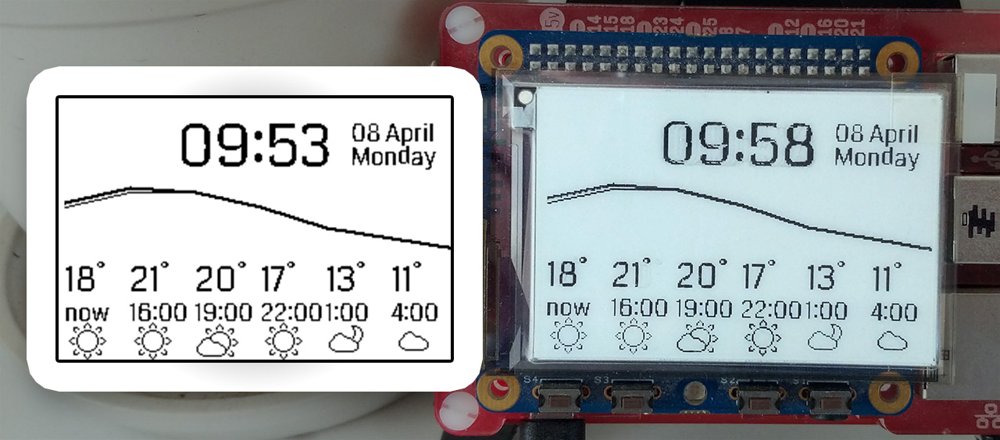

Weather Display for Raspberry Pi E-paper HAT
===

This project shows a clock and weather information on e-paper displays designed for the Raspberry Pi.
Designed to work with the [E-paper HAT by Percheron Electronics][percheron] but might work with others.



## Getting started

Assuming you already have the e-paper HAT succesfully installed. If not, read the detailed instructions [further below][/#epaper].

#### Installation

1. Clone the repo
2. `pip install requests datetime tzlocal urllib`.
3. Get your OpenWeatherMap api key [here][openweather] (it's free).
4. Copy `config.example.py` to `config.py` and edit the file to add your OpenWeatherMap app id, and the latitude and longitude of your location. *Do not skip this step*, the project will not work without customizing the config file.

#### Starting the weather display

Run `./main.py` to run the program. The program will run until you press `Ctrl+C`.

To run the program on boot, in the background, install and run the service like so:

1. Edit `epdash_service.sh` and make sure line 32, which should look like this: `sudo python /home/pi/epaperdash/src/main.py`, to point to the location your `main.py` is at.
2. Install the script as a service, it will run on boot after this:

	```bash
	sudo cp epdash_service.sh /etc/init.d/epdash_service
	sudo chmod +x /etc/init.d/epdash_service
	sudo update-rc.d epdash_service defaults
	```

3. Start the service immediately: `sudo service epdash_service start`


## Features

- Displays the time and date.
- Shows the current temperature and weather condition, plus the forecast of the next five 3-hours intervals.
- Fahrenheit and Celsius mode.
- Adds shutdown and reboot functionality to the buttons.
	- Press button 1 to initiate a reboot, button 2 to shut the Pi down. Confirm with the leftmost buttons, cancel with the rightmost ones.


## <a name"epaper"></a>E-paper installation

To perform the installation of the EPD, run the `epd_setup` script in the root folder. This file is provided by Percheron Electronics and comes with these instructions:

```
Unzip this folder into your /home/pi directory.
Type chmod +x eph_setup to make the script executable.
Type ./eph_setup
The script will update your Pi to the latest software, install
the software needed for your E-paper HAT, then reboot to activate.
Log back in and type sudo echo C >> /dev/epd/command and your screen should blank.
If not, check the fuse driver is running - type sudo service epd-fuse status.
You should get back '[ ok ] EPD FUSE is running.'
Then type cd gratis/PlatformWithOS/driver-common to move to the directory where the test programs live.
Now, if you type sudo ./epd_test_screen 2.7, you should see the screen clear and then display
Percheron Electronics. If you see no change in the display image but get the following message:

clear display
EPD panel broken
images start
image = 0
EPD panel broken

I'm afraid your screen has a crack in it and will not work. 
```


## License

```
Licensed under the Apache License, Version 2.0 (the "License");
you may not use this file except in compliance with the License.
You may obtain a copy of the License at

    http://www.apache.org/licenses/LICENSE-2.0

Unless required by applicable law or agreed to in writing, software
distributed under the License is distributed on an "AS IS" BASIS,
WITHOUT WARRANTIES OR CONDITIONS OF ANY KIND, either express or implied.
See the License for the specific language governing permissions and
limitations under the License.
```

[Contains code from Pervasive Displays, Inc][epdpy], licensed under the same Apache 2.0 License. 


[percheron]: http://www.percheron-electronics.uk/shop/e-paper-hat/
[openweather]: https://openweathermap.org/appid
[epdpy]: src/EPD.py
